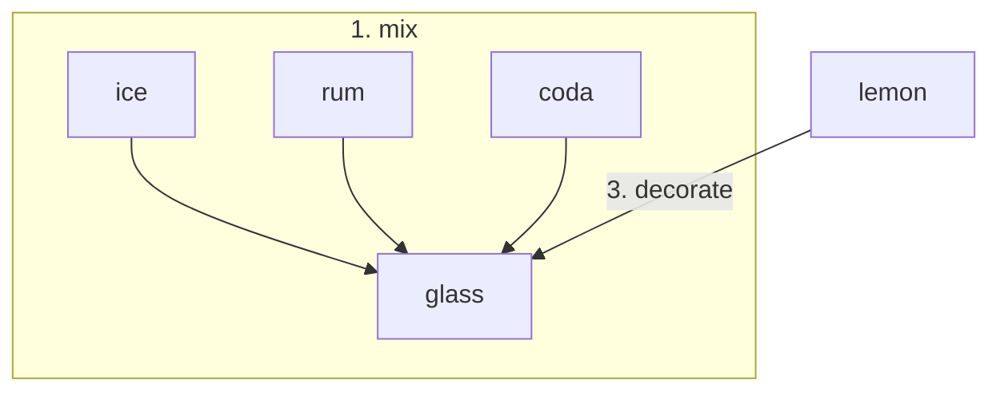
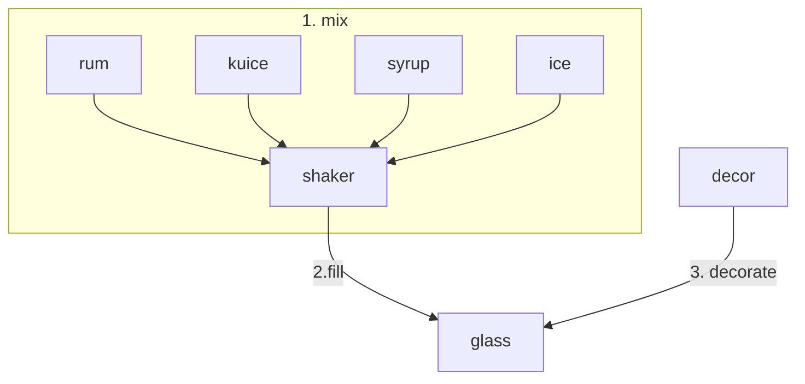
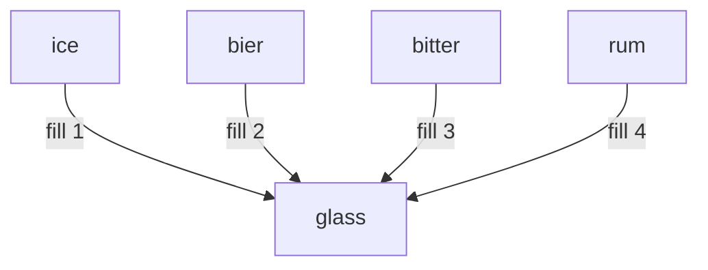
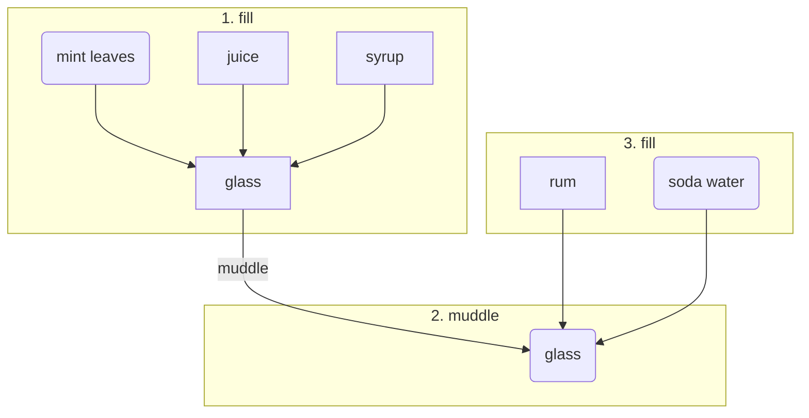
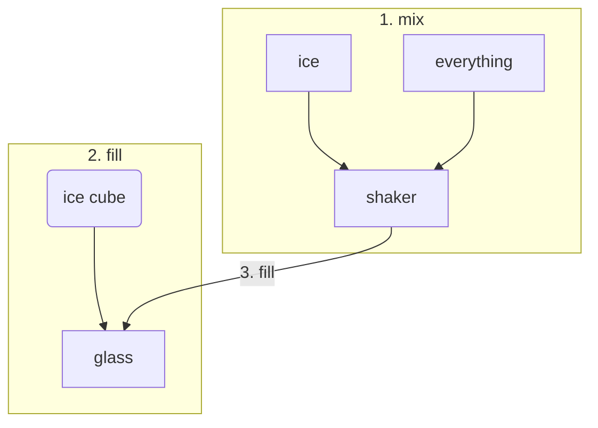

# About Rum
> Rum is a distilled alcoholic drink made by fermenting then distilling sugarcane molasses or sugarcane juice. The distillate, a clear liquid, is usually aged in oak barrels (from six months to many years). Most rums are produced in Caribbean and American countries, but also in other sugar producing countries, such as the Philippines and India.

> Rums are produced in various grades. Light rums (37.5%) are commonly used in cocktails, whereas "golden" and "dark" rums (until 75%) were typically consumed straight or neat, iced ("on the rocks"), or used for cooking, but are now commonly consumed with mixers (like Grog and Punsch). Premium rums are made to be consumed either straight or iced.

# Different Rums
coming soon ...

# Cocktails

## Banana Dream

[Recipes](http://www.cocktaildreams.de/cooldrinks/cocktailrezept.banana-dream.575.html)

[Source](https://www.cuisineaz.com/recettes/cocktail-banana-dream-89162.aspx)

## Cuba Libre
| Ingredients|    |            |  
|----------|:-------------|:-------------|
| 4 | cl |  Bacardi Carta Blanca Rum |
| ? | cl |  Cola |

| Utensil|          
|----------|:-------------|
| Ice cube|
| Long drink glass|

| Decor|          
|----------|:-------------|
|slice of lemon|

## Daiquiri

| Ingredients|    |            |  
|----------|:-------------:|:-------------:|
| 5 | cl |  Bacardi Carta Blanca Rum |
| 3 | cl |  lemon juice |
| 2 | cl |  sugar syrup |

| Utensil|          
|----------|:-------------:|
| Ice|
| Shaker|
| Strainer|
| Martini Glass / Cocktail glass|

| Decor|          
|----------|:-------------:|
|Lemon balm|
|slice of lemon|

[Source](https://static.essen-und-trinken.de/bilder/1a/e1/21346/galleryimage/277d98801c0bbaaffcf3a240fa7090b3.jpg)

## Dark & Stormy

| Ingredients|    |            |  
|----------|:-------------:|:-------------:|
| 5     | cl     |  Gosling's - Black Seal Rum |
| 3     | cl     |  ginger beer |
| some  | dashes |  Angostura bitters|
| 2     | cl     |  Limettensaft |

| Utensil|          
|----------|:-------------:|
| Ice cubes|
| Long drink glass|

| Decor|          
|----------|:-------------:|
|Lemon balm|
|slice of lemon|

[Source](https://galumbi.de/wp-content/uploads/2015/03/Dark-Stormy-1-von-1-2-700x1050.jpg)

## El Presidente

[Source](https://cocktailflow.com/cocktail/el-presidente)

## Grasshopper

[Source](https://www.esquire.com/food-drink/drinks/a26815938/grasshopper-cocktail-drink-recipe/)

## Mojito

| Ingredients|    |            |  
|----------|:-------------:|:-------------:|
| 4-6  | cl    | Bacardi Carta Blanca Rum |
| 1-2  | TL    | sugar syrup |
| 1/2  | slice | lemon juice |
| 6-10 | piece | fresh mint leaves |
| 1-2  | dashes | Angostura bitters |
|      |       | Soda water|

| Utensil|          
|----------|:-------------:|
| ice cubes |
| muddle stick|
| long drink glass|

| Decor|          
|----------|:-------------:|
|Lemon balm|
|mint leaves|

[Source](https://www.gutekueche.at/mojito-cocktail-rezept-17926)

## Planter's Punch

| Ingredients|    |            |  
|----------|:-------------:|:-------------:|
| 3  | cl | dark Rum|
| 3  | cl | light Rum |
| 3  | cl | lemon juice |
| 4  | cl | pineapple juice|
| 4  | cl | organge juice |
| 1  | cl | Grenadine|

| Utensil|          
|----------|:-------------:|
| ice cubes |
| shaker |
| long drink glass|

| Decor|          
|----------|:-------------:|
|Orange slice|

[Source](https://images.eatsmarter.de/sites/default/files/styles/576x432/public/planters-punch-315313.jpg)

## Aged Rum On the Rocks